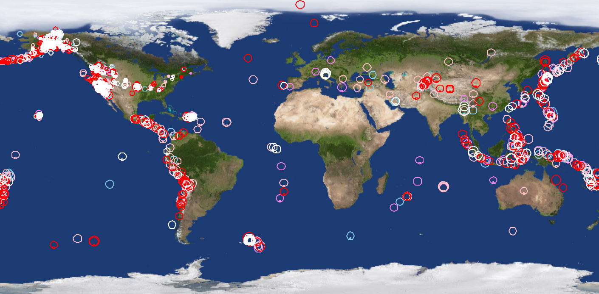

# PlotEarthquakes
A program aimed at plotting data from a chart (CSV) on a map to show historical earthquake trends in July and August of 2016 using turtle graphics

   

<!-- TABLE OF CONTENTS -->

  
Table of Contents

  <ol>
    <li><a href="#Program-Specification">Program Specification</a></li>
    <li><a href="#Turtle-Graphics">Turtle Graphics</a></li>

## Program Specification
This program derives its data from a CSV file based on historical earthquake trends in July and August of 2016. The main driver plots the data onto a map using the following criteria:

- The map image (and turtle canvas) is 720x360 pixels, with (0,0) in the center. 
- Longitude (the x axis) goes from -180 to 180 and latitude (y axis) goes from -90 to 90, so (0,0) is in the center. 
- To get the canvas (x, y) coordinates based on a given (lon, lat) coordinate, multiply each coordinate by 2.
- Circles (plotted data) are sized based on magnitude and colored based on date (skyblue: July before the 29th, violet: July after the 29th, pink: August before the 9th, red: August before the 19th after the 9th, white: August before the 31st after the 19th).

## Turtle Graphics 
The circles are created using Python's turtle graphics and the turtle object’s circle method. The following is the output of the program utilizing turtle graphics to display the data in the CSV file:

